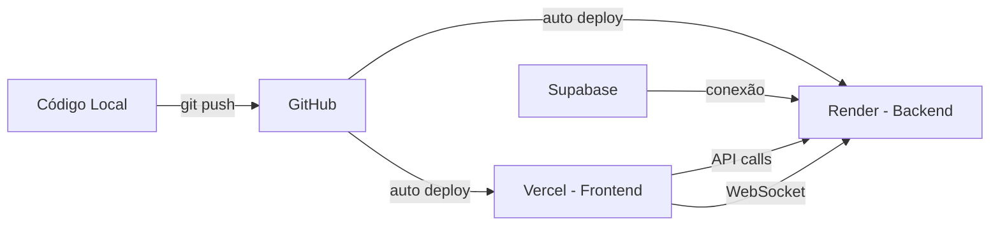

# 📁 Estrutura do Projeto - Deploy em Produção

## 🎯 Visão Geral

Este projeto foi reorganizado para deploy em três plataformas diferentes:
- **Frontend:** Vercel (React + Vite)
- **Backend:** Render (Node.js + Express)
- **Banco de Dados:** Supabase (PostgreSQL)

---

## 📂 Estrutura de Diretórios

```
Disparador-Whatsapp/
│
├── 📱 FRONTEND (Deploy: Vercel)
│   ├── src/
│   │   ├── components/        # Componentes React reutilizáveis
│   │   │   ├── Modal.jsx
│   │   │   ├── QrCode.jsx
│   │   │   └── Sidebar.jsx
│   │   ├── pages/            # Páginas da aplicação
│   │   │   ├── Login.jsx
│   │   │   ├── Usuarios.jsx
│   │   │   ├── CriarCampanha.jsx
│   │   │   ├── Disparador.jsx
│   │   │   ├── GerenciarContatos.jsx
│   │   │   ├── Leads.jsx
│   │   │   └── Relatorios.jsx
│   │   ├── config/           # Configurações
│   │   │   └── api.js        # ⭐ Config de API URLs
│   │   ├── utils/            # Utilitários
│   │   │   └── api.js        # ⭐ Helper de fetch
│   │   ├── App.jsx           # Componente raiz
│   │   ├── App.css
│   │   ├── main.jsx          # Entry point
│   │   └── index.css
│   ├── public/
│   │   └── template_contatos.csv
│   ├── index.html
│   ├── package.json          # Dependências do frontend
│   ├── vite.config.js        # Config do Vite (sem proxy)
│   ├── tailwind.config.js
│   ├── postcss.config.js
│   ├── eslint.config.js
│   ├── vercel.json           # ⭐ Config Vercel
│   ├── .env                  # Variáveis locais (não commitar)
│   └── .env.example          # Template de variáveis
│
├── 🖥️ BACKEND (Deploy: Render)
│   └── backend/
│       ├── config/
│       │   └── database.js      # ⭐ Config PostgreSQL/Supabase
│       ├── middleware/
│       │   └── authMiddleware.js # Middleware JWT
│       ├── routes/
│       │   ├── loginRoutes.js
│       │   ├── usuariosRoutes.js
│       │   ├── campanhasRoutes.js
│       │   ├── contatosRoutes.js
│       │   └── templatesRelatoriosRoutes.js
│       ├── classes/
│       │   └── FilaDisparo.js   # Gerenciamento de fila
│       ├── utils/
│       │   └── importacao.js    # Importação CSV/Excel
│       ├── server.js            # ⭐ Servidor principal
│       ├── package.json         # Dependências do backend
│       ├── render.yaml          # ⭐ Config Render
│       ├── .env                 # Variáveis locais (não commitar)
│       ├── .env.example         # Template de variáveis
│       ├── .gitignore
│       └── README.md
│
├── 📚 DOCUMENTAÇÃO
│   ├── DEPLOY.md              # ⭐ Guia completo de deploy
│   ├── CHECKLIST_DEPLOY.md    # ⭐ Checklist passo a passo
│   ├── INTEGRACAO.md          # Doc de integração
│   ├── DISPARADOR_README.md   # README original
│   └── README.md              # README principal
│
└── 🔧 CONFIGS GERAIS
    ├── script.js              # ⚠️ Script antigo (manter por backup)
    └── .gitignore             # Ignorar node_modules, .env, etc
```

---

## 🔄 Mudanças Principais

### 1️⃣ Separação Backend/Frontend

#### Antes:
```
Todo código junto na raiz
script.js como servidor
Proxy no Vite
```

#### Depois:
```
backend/ → Servidor isolado
src/ → Frontend isolado
Comunicação via HTTPS/WSS
```

### 2️⃣ Configuração de API

#### Arquivo Criado: `src/config/api.js`
```javascript
export const API_URL = import.meta.env.VITE_API_URL;
export const WS_URL = import.meta.env.VITE_WS_URL;
```

#### Arquivo Criado: `src/utils/api.js`
```javascript
export const apiFetch = async (endpoint, options) => {
  // Adiciona URL base automaticamente
  // Adiciona headers e JWT token
}
```

### 3️⃣ Variáveis de Ambiente

#### Frontend (`.env`)
```env
VITE_API_URL=https://backend.onrender.com
VITE_WS_URL=wss://backend.onrender.com
```

#### Backend (ROOT `.env`)
```env
# The project uses a single `.env` in the project root containing backend keys
DB_HOST=db.xxx.supabase.co
DB_USER=postgres
DB_PASSWORD=...
JWT_SECRET=...
FRONTEND_URL=https://frontend.vercel.app

# For Supabase Storage session persistence (recommended for Render Free):
# SUPABASE_URL=https://<your-project>.supabase.co
# SUPABASE_SERVICE_ROLE_KEY=<service-role-key>   # keep this only on the backend (Render)
# SUPABASE_SESSION_BUCKET=wpp-sessions
```

---

## 🚀 Fluxo de Deploy



---

## 📡 Comunicação Entre Serviços

### Frontend → Backend
- **HTTP/HTTPS:** Requisições REST API
- **WebSocket:** Comunicação em tempo real (mensagens, updates)

### Backend → Banco de Dados
- **PostgreSQL:** Conexão via SSL (pg library)
- **Connection String:** Supabase fornece

### Backend → WhatsApp
- **whatsapp-web.js:** Conexão local via Puppeteer
- **⚠️ Nota:** Render Free limpa arquivos de sessão

---

## 🔐 Segurança

### Frontend
- ✅ Variáveis de ambiente (`VITE_*`)
- ✅ JWT armazenado em localStorage
- ✅ HTTPS automático (Vercel)

### Backend
- ✅ CORS configurado
- ✅ JWT Secret forte
- ✅ Senhas com bcrypt
- ✅ SSL no banco de dados
- ✅ Validação de inputs

### Banco de Dados
- ✅ SSL obrigatório
- ✅ Row Level Security (RLS) disponível
- ✅ Backups automáticos

---

## 📊 Escalabilidade

### Recursos Grátis (Free Tier)

| Serviço | Limite | Solução |
|---------|--------|---------|
| **Vercel** | 100GB bandwidth/mês | ⚠️ Monitorar uso |
| **Render** | 750h/mês, dorme após 15min | ⚠️ Usar UptimeRobot |
| **Supabase** | 500MB DB, 2GB transfer | ⚠️ Limpar dados antigos |

### Upgrade Recomendado Para Produção

- **Render:** $7/mês → Disco persistente + sem sleep
- **Supabase:** $25/mês → 8GB DB + backup point-in-time
- **Vercel:** Grátis OK para MVP

---

## 🛠️ Scripts Úteis

### Desenvolvimento Local

```bash
# Frontend
npm run dev                 # Roda em localhost:5173

# Backend
cd backend
npm run dev                 # Roda em localhost:3001 (watch mode)
npm start                   # Produção
```

### Build e Deploy

```bash
# Frontend (local test)
npm run build              # Gera pasta dist/
npm run preview            # Preview da build

# Deploy automático via Git
git add .
git commit -m "Update"
git push origin main       # Trigger auto-deploy
```

### Testes

```bash
# Health check backend
curl https://seu-backend.onrender.com/health

# Test login
curl -X POST https://seu-backend.onrender.com/api/login \
  -H "Content-Type: application/json" \
  -d '{"nome":"admin","senha":"123"}'
```

---

## 📖 Documentação Relacionada

1. **[DEPLOY.md](./DEPLOY.md)** - Guia detalhado de deploy
2. **[CHECKLIST_DEPLOY.md](./CHECKLIST_DEPLOY.md)** - Checklist passo a passo
3. **[backend/README.md](./backend/README.md)** - Documentação do backend
4. **[INTEGRACAO.md](./INTEGRACAO.md)** - Como funciona a integração

---

## 🆘 Troubleshooting Rápido

| Problema | Solução Rápida |
|----------|----------------|
| Frontend não conecta no backend | Verificar `VITE_API_URL` na Vercel |
| CORS error | Verificar `FRONTEND_URL` no Render |
| Database error | Verificar credenciais `DB_*` no Render |
| WebSocket não conecta | URL deve ser `wss://` não `ws://` |
| WhatsApp desconecta | Render Free não persiste sessão |

---

## 🎯 Próximos Passos

- [ ] Domínio customizado
- [ ] CI/CD com testes automatizados
- [ ] Monitoramento com Sentry
- [ ] Backups automáticos
- [ ] Documentação de API (Swagger)
- [ ] Rate limiting
- [ ] Cache com Redis

---

**Última atualização:** Fevereiro 2026  
**Versão:** 1.0.0
